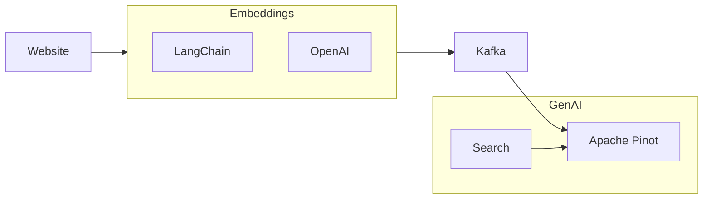

# Real-Time RAG Pinot

This repository is a Retrieval-Augmented Generation (RAG) example using Apache Pinot,  LangChain, and OpenAI. The use case is to load documentation and allow an LLM to answer questions provided by a user. This approach enables you to generate AI responses that are fresh and in real time. A diagram of the data flow is shown in the Mermaid diagram below.



This RAG example uses LangChain's `RecursiveUrlLoader`. It accepts a URL, recursively loads pages, and converts them into `documents`. These documents are converted into embeddings, submitted to a Kafka topic, and consumed by Apache Pinot.

## Docker

This repo builds the Apache Pinot project. You may get an error `No space left on device` when building the container. Execute the command below to free resources before building.

```bash
docker system prune --all --force
```

**NOTE:** Building the Pinot image will take about 25 minutes to finish

## Makefile

To start the example, run the command below.

```bash
make recipe
```

This will start Pinot and Kafka.

Before running the loader or asking questions, export an OpenAI API key in the same shell:

```bash
export OPENAI_API_KEY=your_openai_api_key_here
```

## Load Documentation

Run the command below to load Pinot with embeddings from your document site by providing a URL. The loader will recursively read the document site, generate embeddings, and write them into Pinot.

```bash
make loader URL=https://docs.pinot.apache.org/basics/data-import
```

The loader now defaults to `MAX_DEPTH=0`, which loads only the exact page you pass in. If you want recursive crawling, opt in explicitly:

```bash
MAX_DEPTH=1 make loader URL=https://docs.pinot.apache.org/basics/data-import
```

If you have a large document site, this loader will take longer. You will see confirmations on the screen as each embedding is sent to Kafka and Pinot.

This loader creates an embedding per page so that we can perform an UPSERT in Pinot. If you have larger pages and depending on the AI model you are using, you may get this error:

```
This model's maximum context length is 8192 tokens
```

Alternatively, you can chunk the pages into smaller sizes and UPSERT those records in Pinot by URL + ChunkId. The implementation in this repository does not do that.

Some sites may also emit `Unable to load ... TimeoutError` for individual pages while crawling. That message comes from the recursive URL loader and becomes more common as `MAX_DEPTH` increases. A missing `OPENAI_API_KEY` does stop the run when the first embedding request is made.

## Load Student Rows

This recipe can also ingest structured student rows into a separate Pinot realtime table named `student`.

Create the topic and table:

```bash
make student_recipe
make student_exam_recipe
make student_fees_recipe

```

Load the sample CSV rows from `data/students.csv`:

```bash
make student_loader

make student_exam_loader

make student_fees_loader

```

To load a different file, point `STUDENT_CSV` at a CSV mounted from this recipe directory:

```bash
make student_loader STUDENT_CSV=/code/data/my_students.csv
```

The CSV header must match the student schema:

```text
student_id,name,age,grade,department,city,gpa,attendance_pct
```

## Ask Your Questions

Run the command below and ask a question that the documentation you loaded can answer.

```bash
make question
make student_question
```

In [genai.py](docker/genai.py), you will see the below statement. The `VECTOR_SIMILARITY` function takes the embedding column and the search query embedding and returns the top `10` most similar vectors.

```sql
with DIST as (
    SELECT 
        source, 
        content, 
        metadata,
        cosine_distance(embedding, ARRAY{search_embedding}) AS cosine
    from documentation
    where VECTOR_SIMILARITY(embedding, ARRAY{search_embedding}, 10)
)
select * from DIST
where cosine < {dist}
order by cosine asc
limit {limit}
```
